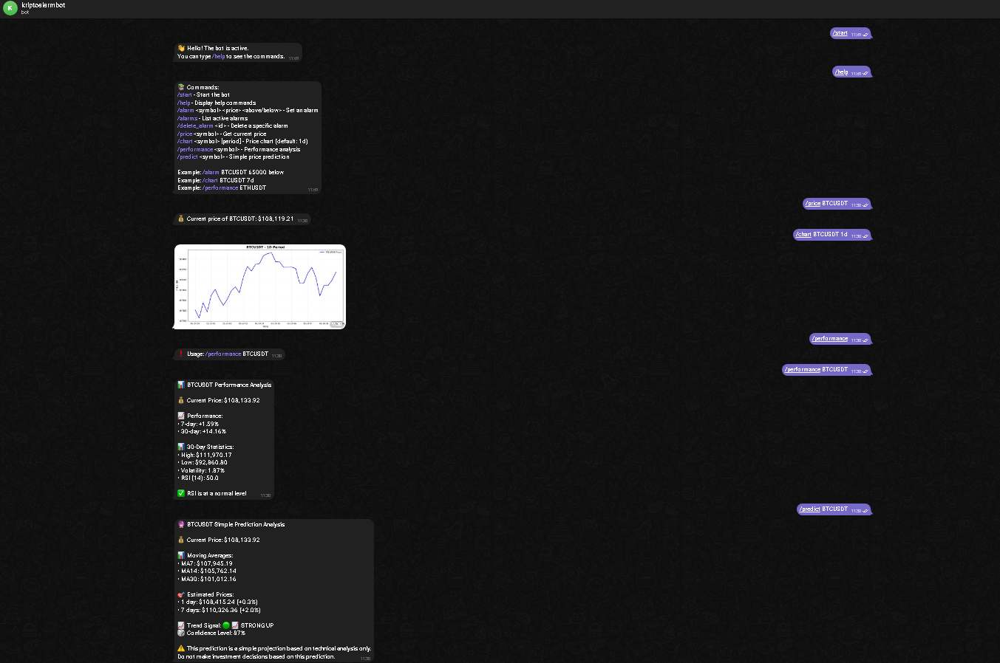

# 💸 Crypto Price Alert Telegram Bot

A feature-rich **Telegram bot** for tracking cryptocurrency prices, setting alarms, and analyzing market performance – powered by Python, `python-telegram-bot`, and `yfinance`.

## 🚀 Features

* `/alarm` – Set price alerts (above or below a target)
* `/alarms` – List all active alerts
* `/delete_alarm` – Delete an alert by ID
* `/price` – Get the current price of a cryptocurrency
* `/chart` – View price chart for 1d, 7d, 1mo, etc.
* `/performance` – 7/30-day performance summary + volatility + RSI
* `/predict` – Simple AI-powered trend and price forecast
* Telegram notifications when alarms are triggered
* CoinGecko API used for live prices
* Alerts are stored in an SQLite database
* Auto-scheduler checks every 5 minutes

---

## 📦 Installation

```bash
git clone https://github.com/yourusername/crypto-alert-bot.git
cd crypto-alert-bot
python setup.py
```

---

## ⚙️ Environment Variables (`.env`)

Create a `.env` file at the project root with the following:

```env
TELEGRAM_BOT_TOKEN=your_telegram_bot_token
```

Other optional keys (currently unused):

```env
BINANCE_API_KEY=your_key
BINANCE_API_SECRET=your_secret
EXCHANGE_RATE_API_KEY=your_key
```

---

## 🧲 Commands & Usage

| Command                                 | Description                    | Example                      |
| --------------------------------------- | ------------------------------ | ---------------------------- |
| `/start`                                | Start the bot                  | -                            |
| `/help`                                 | View command list              | -                            |
| `/alarm <SYMBOL> <PRICE> <above/below>` | Set price alert                | `/alarm BTCUSDT 65000 above` |
| `/alarms`                             | List your active alerts        | -                            |
| `/delete_alarm <ID>`                       | Remove an alert by ID          | `/delete_alarm 2`               |
| `/price <SYMBOL>`                       | Get current price              | `/price ETHUSDT`             |
| `/chart <SYMBOL> [PERIOD]`             | View chart (1d, 7d, 1mo)       | `/chart BTCUSDT 7d`         |
| `/performance <SYMBOL>`                  | Performance analysis + RSI     | `/performance BTCUSDT`        |
| `/predict <SYMBOL>`                      | Price forecast based on trends | `/predict BTCUSDT`            |

---

## 🛠 Tech Stack

* **Python 3.8+**
* [`python-telegram-bot`](https://github.com/python-telegram-bot/python-telegram-bot)
* `yfinance` for historical data & charts
* `matplotlib` for image generation
* `sqlite3` for alert persistence
* `dotenv` for config management

---

## 📸 Screenshots



---

## 📌 To Do

* [ ] Multi-currency support (USD/EUR/TRY)
* [ ] User preferences for notifications
* [ ] Admin panel to manage alarms
* [ ] Dockerize deployment

---

## 🧠 Disclaimer

> This bot is for **educational & informational** purposes only. Do not use it to make financial decisions. No investment advice is provided.

---

## 🧑‍💻 Author

Made with ❤️ by [Your Name](https://github.com/muhammedmed/cryptotelegrambot.git)
Telegram: [@yourbot](https://t.me/kriptooalarmbot)

---

## 🧪 License

MIT License – free to use and modify.
